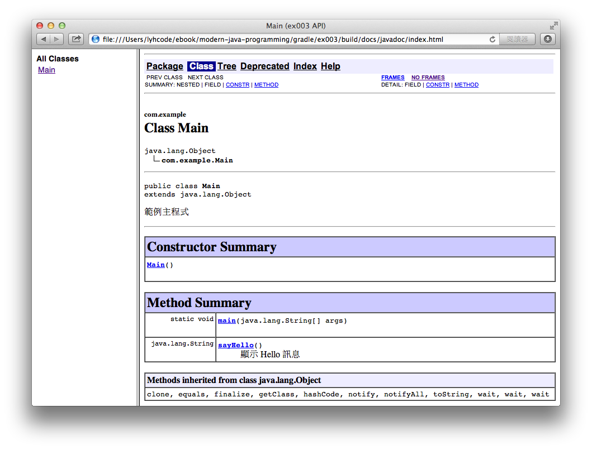

使用 Gradle 自動化建置 Java 專案（三）
==================================

Gradle 是用途廣泛的建置工具，但最重要的一點，就是非常適合處理 Java 專案，它讓 Java 專案自動化建置（Build Automation）變得更容易上手。

在程式碼中撰寫良好的註解，是程式設計師的重要修煉之一。良好的 Java 註解，還必須依循 JavaDoc 的規範，如此就可以利用 JDK 提供的 javadoc 工具，快速產生標準的 Java API 文件，方便其他人隨時查詢最新的類別（或函式）使用說明，這也是 Java 專案自動化建置的重要流程。

* JavaDoc - http://www.oracle.com/technetwork/java/javase/documentation/index-137868.html

* [The Java Plugin](http://www.gradle.org/docs/current/userguide/java_plugin.html)


### 產生 JavaDoc 文件 ###

JavaDoc 提供程式碼的註解撰寫規範，可以將註解用來自動產生 API 說明文件，以下範例修改 Main.java 增加部分註解文字。

src/main/java/com/example/Main.java

```
package com.example;

import org.apache.commons.codec.binary.Base64;

/**
 * 範例主程式
 */
public class Main {

    public static void main(String args[]) {
        System.out.println(new Main().sayHello());

        Base64 base64 = new Base64();
        byte[] bytes = base64.encode("I Love Gradle".getBytes());

        System.out.println(new String(bytes));
    }

    /**
     * 顯示 Hello 訊息
     * @return 回傳 Hello 訊息文字
     */
    public String sayHello() {
        return "Hello";
    }
}
```

我們在以上範例程式碼中使用中文字，並將檔案儲存為 UTF-8 編碼格式；為避免 Gradle 誤用系統預設的編碼（如 BIG5）處理，需要在 build.gradle 加入以下兩行設定，如此程式碼及 JavaDoc 的編碼才能正確運作。

build.gradle

```
apply plugin: 'java'

javadoc.options.encoding = 'UTF-8'
compileJava.options.encoding = 'UTF-8'

repositories {
    mavenCentral()
}

dependencies {
    compile 'commons-codec:commons-codec:1.8'
}

task run(type: JavaExec) {
    main = 'com.example.Main'
    classpath = configurations.compile + sourceSets.main.output
}
```

接著利用 javadoc 指令產生文件。

```
gradle javadoc
```

如果執行正確，就會在 build/docs 資料夾中產生 JavaDoc 文件。使用瀏覽器打開以下位置的文件，就可以看到專案 API 的網頁文件。

* build/docs/javadoc/index.html



Gradle 的自動化建置可以輕鬆幫專案產生 JavaDoc 文件，讓其他人也方便瀏覽這份文件的最新版，就可以間接鼓勵每位開發成員盡可能將註解寫好。但是要怎麼讓最新的 JavaDoc 文件，隨時都能存取呢？

簡單方法就是利用 Gradle 的檔案系統或網路傳輸操作，將產生的網頁檔案複製到可以被存取的位置。

更好的作法，就是搭配持續整合（CI, Continuous Integratio）系統，例如程式碼每次 commit/push 到版本控制系統後，就利用事件自動觸發持續整合系統，利用 Gradle 的 javadoc 任務自動產生文件，並將產生的網頁檔案放置在某個可以供遠端存取的 URL 位置。

目前最優秀的 Jenkins 持續整合工具，已經內建對 Gradle 的支援，當然也包含 JavaDoc 網頁文件的存取功能。

本文使用的範例程式碼，可在以下網址取得：

* http://git.io/rT2jwg

參考資料：

1. [Building and Testing with Gradle, O'Reilly](http://shop.oreilly.com/product/0636920019909.do)
2. [Gradle User Guide](http://www.gradle.org/documentation)
